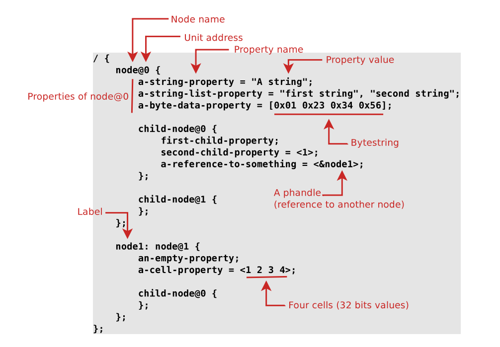
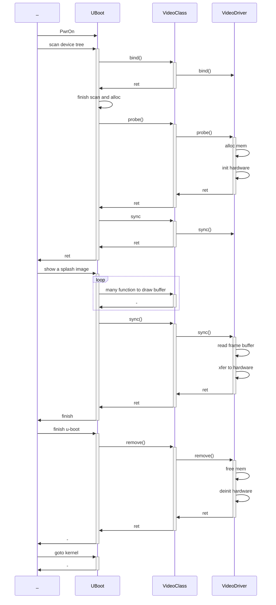

# U-boot module Dev 

This file is a notebook that I learn u-boot module dev.

# Device Tree

u-boot use device tree to descript hardware.


## Device Tree syntax

look forward to linux device tree

`Petazzoni-device-tree-dummies_0.ppt`


### What is node@adress?

https://devicetree-specification.readthedocs.io/en/stable/devicetree-basics.html

https://elinux.org/Device_Tree_Usage

`node-name` is any name you wnat to give.

Unit address can be get in driver code (`reg`),it depends on each driver,may ignored.

### What is label?

Set a name that can be referred by property's value.

### What is `chosen`

Send args to u-boot. the arguement must be known by u-boot


## How Driver is related to dt(device tree)

It is the design of u-boot, its name is `Driver model` ,detail:https://docs.u-boot.org/en/stable/develop/driver-model/index.html .

### The life cycle

https://docs.u-boot.org/en/v2020.04/driver-model/design.html?highlight=probe

this link is very usefull to understand it at a whole level.


https://u-boot.readthedocs.io/en/stable/develop/driver-model/of-plat.html

using u-boot module define macro.

```c
static const struct udevice_id sandbox_serial_ids[] = {
   { .compatible = "sandbox,serial" },
   { }
};

U_BOOT_DRIVER(sandbox_serial) = {
   .name   = "sandbox_serial",
   .id   = UCLASS_SERIAL,
   .of_match    = sandbox_serial_ids,
   .of_to_plat  = sandbox_serial_of_to_plat,
   .plat_auto   = sizeof(struct sandbox_serial_plat),
   .priv_auto   = sizeof(struct sandbox_serial_priv),
   .probe = sandbox_serial_probe,
   .remove = sandbox_serial_remove,
   .ops   = &sandbox_serial_ops,
   .flags = DM_FLAG_PRE_RELOC,
};
```

- `.name`: is the name of this module,it doesn't associately with dts(?)

- `.id`: is identifying what class of device it is,it is very important.Different id has different behavior.disccused in next properties.
- `.of_match`: it determin how dts find this module.While the `compatible` property in dts, is matched with the item in `of_match`.dts system will load this module.
- `.of_to_plat`: after match,dts system will generate c code,to convert read the dts property in to the struct defined by this property.The struct field name is essential,must be matched with dts ones.

- `.priv_auto`: private data,nothing to do with dts.
- `.probe`: when module probe
- `.remove`: when module remove
- `.ops`: for each `.id` uclass, the ops is different.eg.If UClass is `UCLASS_SPI`,then the ops should be an `struct dm_spi_ops`.
- `.flags`: todo://


# UClass

Define a uclass

```
/**
 * struct uclass_driver - Driver for the uclass
 *
 * A uclass_driver provides a consistent interface to a set of related
 * drivers.
 *
 * @name: Name of uclass driver
 * @id: ID number of this uclass
 * @post_bind: Called after a new device is bound to this uclass
 * @pre_unbind: Called before a device is unbound from this uclass
 * @pre_probe: Called before a new device is probed
 * @post_probe: Called after a new device is probed
 * @pre_remove: Called before a device is removed
 * @child_post_bind: Called after a child is bound to a device in this uclass
 * @child_pre_probe: Called before a child in this uclass is probed
 * @child_post_probe: Called after a child in this uclass is probed
 * @init: Called to set up the uclass
 * @destroy: Called to destroy the uclass
 * @priv_auto: If non-zero this is the size of the private data
 * to be allocated in the uclass's ->priv pointer. If zero, then the uclass
 * driver is responsible for allocating any data required.
 * @per_device_auto: Each device can hold private data owned
 * by the uclass. If required this will be automatically allocated if this
 * value is non-zero.
 * @per_device_plat_auto: Each device can hold platform data
 * owned by the uclass as 'dev->uclass_plat'. If the value is non-zero,
 * then this will be automatically allocated.
 * @per_child_auto: Each child device (of a parent in this
 * uclass) can hold parent data for the device/uclass. This value is only
 * used as a fallback if this member is 0 in the driver.
 * @per_child_plat_auto: A bus likes to store information about
 * its children. If non-zero this is the size of this data, to be allocated
 * in the child device's parent_plat pointer. This value is only used as
 * a fallback if this member is 0 in the driver.
 * @flags: Flags for this uclass (DM_UC_...)
 */
```

Example

```c
   UCLASS_DRIVER(i2c) = {
   .id         = UCLASS_I2C,
   .name       = "i2c",
   .flags      = DM_UC_FLAG_SEQ_ALIAS,
   .post_bind  = i2c_post_bind,
   .pre_probe  = i2c_pre_probe,
   .post_probe = i2c_post_probe,
   .per_device_auto   = sizeof(struct dm_i2c_bus),
   .per_child_plat_auto   = sizeof(struct dm_i2c_chip),
   .child_post_bind = i2c_child_post_bind,
};
```

- `.post_bind`: hook
- `.pre_probe`: thook
- `.post_probe`: hook
- `.per_device_auto`: define priv data that can de read by device
- `.per_device_plat_auto`: define platorm data(dts properties) that this class have.The device should have these properties.
- `.per_child_plat_auto`:define the child-node of the uclass's platform data(properties).The children should have these properties
- `.child_post_bind`: child bind hook

## Detail of each UClass

Read the code:

-  `drivers/xxx/xxx-uclass.c`

- `include/xxx/xxx.h`

    

# Driver

todo


# Project：Make a spi panel dsiaplay a splash img

The UClass of this is `UCLASS_VIDEO` source code :`video/video_uclass.c`.

op is

```
struct video_ops {
	int (*video_sync)(struct udevice *vid);
};
```

There is no reference driver.
## 1. Hello world
### Add file to compile
Quick Start:
- Edit the makefile under video,`video/Makefile`,hard code add obj( config-aware setting will do later)
  ```
  obj-y += lpm027.o
  ```

- create `lpm027.c` under `video/`

- copy the template

    ```c
    #include <common.h>
    #include <env.h>
    #include <dm.h>
    #include <malloc.h>
    #include <video.h>
    #include <video_fb.h>
    #include <log.h>
    static int lpm027_video_bind(struct udevice *dev){
    	return 0;
    }
    
    static int lpm027_video_probe(struct udevice *dev){
    	struct video_uc_plat *uc_plat = dev_get_uclass_plat(dev);
    	struct video_priv *uc_priv = dev_get_uclass_priv(dev);
    	log_info("lpm027_video_probe");
    	return 0;
    }
    
    static const struct udevice_id lpm027_video_ids[] = {
    	{ .compatible = "sharp,lpm027" },
    	{ /* sentinel */ }
    };
    
    static int lmp027_ops_sync(struct udevice *vid){
    	log_info("lpm027_sync");
    	return 0;
    }
    
    struct video_ops lmp027_ops{
    	.video_sync = lmp027_ops_sync
    };
    
    U_BOOT_DRIVER(lpm027_video) = {
    	.name   = "sharp_lpm027",
    	.id     = UCLASS_VIDEO,
    	.of_match = lpm027_video_ids,
      .bind   = lpm027_video_bind,
    	.probe  = lpm027_video_probe,
    	.flags  = DM_FLAG_PRE_RELOC | DM_FLAG_OS_PREPARE,
    	.ops    = &lmp027_ops
    };
    
    ```

### Edit Device tree

To know current device tree,You should grep file  `.config` under u-boot root.

```
CONFIG_DEFAULT_DEVICE_TREE="sun50i-h616-orangepi-zero2w"
```

then the device tree should under `./arch/arm/dts/sun50i-h616-orangepi-zero2w.dts`

Add these line under root node:

```dtd
video: video {
        compatible = "sharp,lpm027";
};
```

### Find UCALSS_VIDEO's plat

```
/**
 * struct video_uc_plat - uclass platform data for a video device
 *
 * This holds information that the uclass needs to know about each device. It
 * is accessed using dev_get_uclass_plat(dev). See 'Theory of operation' at
 * the top of video-uclass.c for details on how this information is set.
 *
 * @align: Frame-buffer alignment, indicating the memory boundary the frame
 *      buffer should start on. If 0, 1MB is assumed
 * @size: Frame-buffer size, in bytes
 * @base: Base address of frame buffer, 0 if not yet known
 * @copy_base: Base address of a hardware copy of the frame buffer. See
 *      CONFIG_VIDEO_COPY.
*/
struct video_uc_plat {
    uint align;
    uint size;
    ulong base;
    ulong copy_base;
};
```

`align` use default 1M

`size` is placeholder now ,we assume 96000

`base` is caculated by uclass

`copy_base` unknown


Insert the neccesary plat only.

```dtd
video: video {
      compatible = "sharp,lpm027";
      size = <96000>;
};
```

### Turn On makemenu Options

make sure `Driver->Graphics->LCD/video` is enabled.and enable the `pixel size 32`;

depends on your platform maybe `Driver->Graphics->Display Splash Image /bmp...` also needs to be turned on.


and build ...

and flash ...


### Hello world!
```
U-Boot 2021.07-orangepi (Nov 28 2023 - 08:50:25 +0000) Allwinner Technology

CPU:   Allwinner H616 (SUN50I)
Model: OrangePi Zero2 W
I2C:   ready
DRAM:  4 GiB
MMC:   mmc@4020000: 0
Loading Environment from FAT... Unable to use mmc 0:1... lpm027_video_probelpm027_syncIn:    serial@5000000
Out:   serial@5000000
Err:   serial@5000000
230456 bytes read in 20 ms (11 MiB/s)
Error: 1 bit/pixel mode, but BMP has 24 bit/pixel
starting USB...
No working controllers found
Autoboot in 0 seconds, press <Space> to stop
```

`lpm027_video_probe` and `lpm027_sync` is printed.

## 2. Deal with image source

### Figure out the sequence of UCLASS_VIDEO

After read some code and considered a general rule of program design.I assume the seuqence may looks like this: 



### Verify the sequence

1. remove size,this should be calculated by driver.

    ```dtd
      video: video {
          compatible = "sharp,lpm027";
          // remove --> size = <96000>;
      };
    ```

2. set `plat` when `bind`

    ```c
    #define LPM027_WIDTH 400
    #define LPM027_HEIGHT 240
    
    ...
      
    static int lpm027_video_bind(struct udevice *dev){
            struct video_uc_plat *uc_plat = dev_get_uclass_plat(dev);
            uc_plat->size = LPM027_WIDTH * LPM027_HEIGHT * 4;
            return 0;
    }
    
    ```

3. set `priv` when `probe`

    ```c
    static int lpm027_video_probe(struct udevice *dev){
            struct video_uc_plat *uc_plat = dev_get_uclass_plat(dev);
            struct video_priv *uc_priv = dev_get_uclass_priv(dev);
            log_info("lpm027_video_probe");
            uc_priv->xsize = LPM027_WIDTH;
            uc_priv->ysize = LPM027_HEIGHT;
            uc_priv->bpix  = VIDEO_BPP32;
            memset(uc_plat->base,0,uc_plat->size);
            return 0;
    }
    ```
    
    all the privs that can/should be set descripted at `video.h`
    
    ```c
    struct video_priv {
            /* Things set up by the driver: */
            ushort xsize;
            ushort ysize;
            ushort rot;
            enum video_log2_bpp bpix;
            const char *vidconsole_drv_name;
            int font_size;
    ...
    ```
    
4. Check the frame buffer `uc_plat->base`.see whether the buffer is filled with any data?

    ```c
    static int lmp027_ops_sync(struct udevice *dev){
            log_info("lpm027_sync");
    
            struct video_uc_plat *uc_plat = dev_get_uclass_plat(dev);
            uint32_t *p = (uint32_t*)uc_plat->base;
            bool all_zero = true;
            for(int y = 0; y < LPM027_HEIGHT;y ++){
                    for(int x = 0;x < LPM027_WIDTH;x++){
                            if( *p != 0){
                                    all_zero = false;
                                    break;
                            }
                            p++;
                    }
            }
            log_info(",all_zero=%d\n",all_zero);
            return 0;
    }
    ```

    

### Result

  ```

U-Boot 2021.07-orangepi (Nov 28 2023 - 20:34:42 +0000) Allwinner Technology

CPU:   Allwinner H616 (SUN50I)
Model: OrangePi Zero2 W
I2C:   ready
DRAM:  4 GiB
MMC:   mmc@4020000: 0
Loading Environment from FAT... Unable to use mmc 0:1... lpm027_video_probelpm027_sync,all_zero=1
In:    serial@5000000
Out:   serial@5000000
Err:   serial@5000000
230456 bytes read in 20 ms (11 MiB/s)
lpm027_sync,all_zero=0
starting USB...
No working controllers found
Autoboot in 0 seconds, press <Space> to stop
  ```

It worked.

First time sync is called, the buffer is all zero,and second time sync get called,its frame buffer is changed.

## 3. Sink the image through SPI

### A. how to Control gpio

by reading the code of `gpio_leds`,we can figure out 

#### Example

```dtd
pio: pinctrl@300b000 {
                compatible = "allwinner,sun50i-h616-pinctrl";
                reg = <0x0300b000 0x400>;
===================================================
leds {
        compatible = "gpio-leds";

        led-0 {
                function = LED_FUNCTION_POWER;
                color = <LED_COLOR_ID_RED>;
                gpios = <&pio 2 12 GPIO_ACTIVE_HIGH>; /* PC12 */
                default-state = "on";
        };

};

```

```c
dev_for_each_subnode(node, parent) {
  ...
	ret = gpio_request_by_name(dev, "gpios", 0, &priv->gpio, GPIOD_IS_OUT);
	if (ret != 0)
  	return ret;
  
  
```

#### Write the code

```c
#include <asm/gpio.h>

struct ls027_video_priv {
	struct gpio_desc gpio_disp;
	struct gpio_desc gpio_vcom;
};

static int ls027_video_probe(struct udevice *dev){
	// ...
  struct ls027_video_priv *dv_priv = dev_get_priv(dev);
	int ret = 0;
  
  ret = gpio_request_by_name(dev, "disp", 0, &dv_priv->gpio_disp, GPIOD_IS_OUT);
	if (ret) return ret;
	
	ret = gpio_request_by_name(dev, "vcom", 0, &dv_priv->gpio_vcom, GPIOD_IS_OUT);
	if (ret) return ret;

  // ...
}

U_BOOT_DRIVER(ls027_video) = {
	// ...
	.priv_auto	= sizeof(struct ls027_video_priv),
	// ...
};
```

```dtd
	video: video {
		compatible = "sharp,lpm027";
		vcom-gpios = <&pio 8 5 0>;
		disp-gpios = <&pio 8 14 0>;
	};
```


### B. How to use spi

Make video as a child of spi node.

```
&spi1  {
	status = "okay";
	spi-max-frequency = <1000000>;
	video: video {
		compatible = "sharp,lpm027";
		vcom-gpios = <&pio 8 5 0>;
		disp-gpios = <&pio 8 14 0>;

		spi-max-frequency = <1000000>;
		spi-cs-high = <1>;
	};
}
```

Platform will define its common peripheral under "dtsi" file.In this case, `spi1 : spi@xxxx` is defined in platform's dtsi,if we want to edit/add spi1's properties,we can refer it by `&` and edit its properties.

Each child of spi should always define properties like this,

```
spi-cs-high = <1>;
```

It is defined at `spi-uclass.c` function: `int spi_slave_of_to_plat(struct udevice *dev, struct dm_spi_slave_plat *plat)`

- Turn On menuconfigure

    ```
    Drevice Driver -> SPI support 
    	[*] Enable Driver Model for SPI drivers
    ```

    

```c
struct spi_slave *slave = dev_get_parent_priv(dev);

/* Claim spi bus */
ret = spi_claim_bus(spi);
if (ret) {
  debug("SF: Failed to claim SPI bus: %d\n", ret);
  return ret;
}


ret = spi_xfer(slave, 16, dout, din, SPI_XFER_BEGIN | SPI_XFER_END);

spi_release_bus(slave);
```

## 4. Write the driver code

Write the code.

## 5. Set up the configure
- Edit the KConfig under `video`

```
config VIDEO_LS027
	bool "Enable Sharp LS027 serial spi memory screen support"
	default n
	depends on DM_VIDEO && DM_SPI
	help
	  This enables LS027 driver which can be used,LS027 is a serials of 
	  screen from Sharp.

```

VIDEO_LS027 is defined and it depends on `DM_VIDEO` `DM_SPI`, and we can find it from menuconfig.

- Edit the Makefile under `video`

```
# remove this line before
obj-y += ls027.o
# replace with this
obj-$(CONFIG_VIDEO_LS027) += ls027.o
```
## 6. Create your own defconfig

- Copy `.config` to `configs/orangepi-zero2w-beepy_defconfig`

- Set a name of edited `dts`,for example `sun50i-h616-orangepi-zero2-beepy.dts`copy it to `arch/arm/dts`

- Modify `xxx_defconfig` replace the `CONFIG_OF_LIST` and `CONFIG_DEFAULT_DEVICE_TREE`

- Modify the Makefile of `arch/arm/dts`.append the line in corrected target

```
dtb-$(CONFIG_MACH_SUN50I_H5) += \
...
sun50i-h5-orangepi-zero-plus.dtb\
...
```


# Reference

## Logging 

https://docs.u-boot.org/en/stable/develop/logging.html?highlight=log

```
#include <log.h>

log_err(_fmt…)
log_warning(_fmt…)
log_notice(_fmt…)
log_info(_fmt…)
log_debug(_fmt…)
log_content(_fmt…)
log_io(_fmt…)
```

## Make

```
make -j16 ARCH=arm CROSS_COMPILE="aarch64-none-linux-gnu-"
```

## Patches

### Lpddr4 timing

A ram timing problem of zero2w(4g ram),causing random blocking when booting.

A genius fixed it, https://github.com/orangepi-xunlong/u-boot-orangepi/pull/12/commits/3a5a08b9a3073590511b8fceec8d79cf8a9285d0

```
arch/arm/mach-sunxi/dram_timings/h616_lpddr4.c
 

 @@ -30,7 +30,7 @@ void mctl_set_timing_params(struct dram_para *para)
 	u8 trp		= ns_to_t(21);		/* JEDEC: >= 13.75 ns */
 	u8 tras		= ns_to_t(42);		/* JEDEC >= 36 ns, <= 9*trefi */
 	u16 trefi	= ns_to_t(3904) / 32;	/* JEDEC: 7.8us@Tcase <= 85C */
 	u16 trfc	= ns_to_t(180);		/* JEDEC: 160 ns for 2Gb */
 	u16 trfc	= ns_to_t(280);		/* JEDEC: 160 ns for 2Gb */
```

/