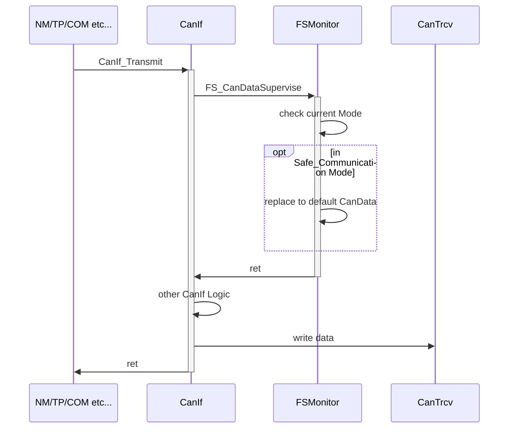
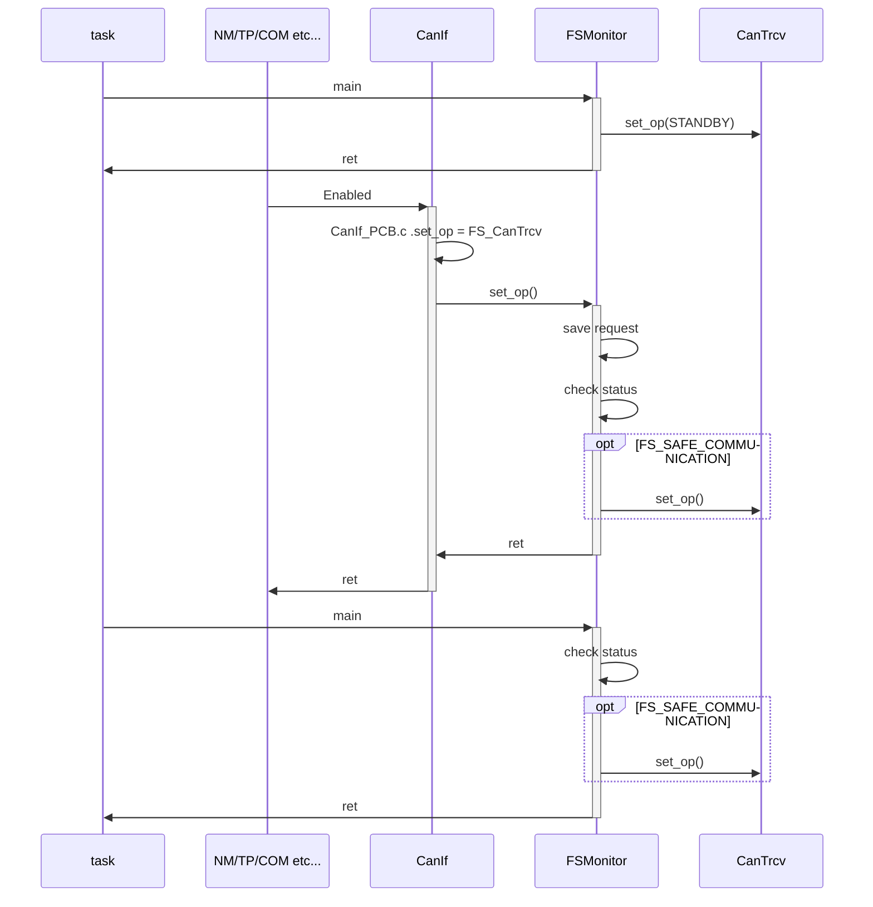

|SAFE_SILENT                  | SAFE_COMMUNICATION | NORMAL_COMMUNICATION | SAFE_COMMUNICATION

开机->BSW  --------> FS    | state transition                                                                     cat3 happens

​              NM XXXXXXXXXX

​           					    Self->finish(Cat2)

​                    				app ------------------------------------------------------> soc pwr on

|-----------------                  | SAFE_COMMUNICATION | NORMAL_COMMUNICATION | SAFE_COMMUNICATION

开机->BSW  --------> FS   | state transition                                                                     cat3 happens

​           					   Self->finish(Cat2)

​                    			  app ------------------------------------------------------> soc pwr on

